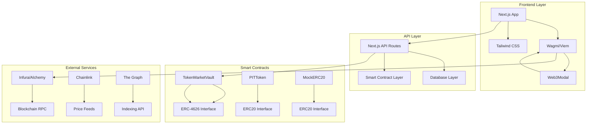
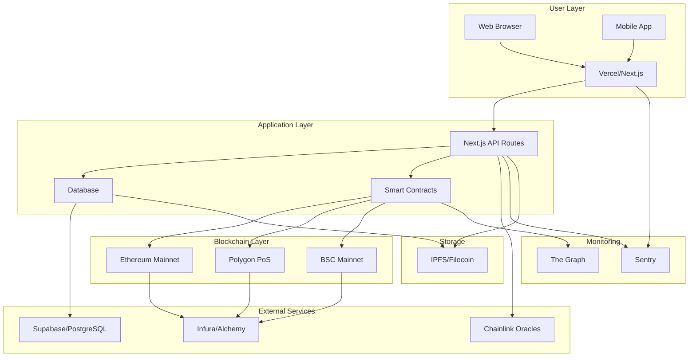

# 🏗️ TokenMarket Architecture Guide

## Overview

This document provides a comprehensive technical architecture overview of the TokenMarket platform, covering smart contracts, frontend, backend, and deployment infrastructure.

---

## 🎯 System Architecture

### High-Level Architecture



---

## 🔧 Smart Contract Layer

### ERC-4626 Rebalancing Vault

#### **Contract Overview**
```solidity
contract TokenMarketVault is ERC4626, AccessControl {
    // Core functionality
    function depositAndCreateStrategy(...) external returns (uint256 shares)
    function executeRebalance(...) external
    function collectPerformanceFees(...) external returns (uint256)

    // Administrative
    function emergencyPause() external
    function emergencyResume() external
    function enableWhitelist() external
}
```

#### **Key Features Implemented**
- ✅ **Strategy Management**: User-created trading strategies
- ✅ **Asset Allocation**: Target weight management
- ✅ **Rebalancing Logic**: Time-based automated trades
- ✅ **Fee Collection**: Performance-based creator rewards
- ✅ **Emergency Controls**: Circuit-breakers and pauses

#### **Security Features**
- 🔒 **Access Control**: Multi-role permission system
- 🔒 **Input Validation**: Comprehensive parameter checking
- 🔒 **Reentrancy Protection**: Non-reentrant modifiers
- 🔒 **Emergency Pausing**: Protocol-wide pause mechanisms

### PIT Token System

#### **Token Economics**
```solidity
contract PITToken is ERC20Permit {
    // Fee structure
    uint256 constant TRADING_FEE = 5; // 0.05%

    function transferWithFee(address recipient, uint256 amount) external
    function mintPIT(address to, uint256 amount) external
    function burnPIT(address from, uint256 amount) external
}
```

#### **Economic Model**
- 💰 **Trading Fees**: 0.05% collected on all transfers
- 💰 **Creator Rewards**: Automated fee distribution
- 💰 **Staking Incentives**: Reward mechanisms for holders
- 💰 **Inflation Control**: Minting caps and controls

---

## 🌐 Frontend Architecture

### Technology Stack

```typescript
// Core dependencies
const coreStack = {
  framework: "Next.js 15.5.3",
  language: "TypeScript 5.x",
  styles: "Tailwind CSS",
  animations: "Framer Motion",
  forms: "React Hook Form + Zod",
  state: "React Query + Zustand",
  web3: "Wagmi v2 + Viem"
}

// UI Components
const componentStack = {
  primitives: "Radix UI",
  icons: "Lucide React",
  charts: "Recharts",
  notifications: "React Toast"
}
```

### Application Structure

```
src/
├── app/                    # Next.js App Router
│   ├── (auth)/            # Authentication pages
│   ├── (dashboard)/       # Protected dashboard pages
│   └── api/               # API route handlers
├── components/            # Reusable UI components
│   ├── ui/               # Primitive components
│   ├── forms/           # Form components
│   ├── wallet/          # Wallet-related components
│   └── charts/          # Data visualization
├── contexts/             # React contexts
│   ├── auth-context.tsx # Authentication state
│   └── web3-context.tsx  # Web3 connection state
├── hooks/                # Custom React hooks
│   ├── useContract.ts   # Smart contract interactions
│   └── useToken.ts      # Token management
├── lib/                  # Utility functions
│   ├── utils.ts         # General utilities
│   ├── web3.ts          # Web3 helper functions
│   └── constants.ts     # Application constants
└── types/                # TypeScript definitions
    ├── smart-index.ts   # Smart Index types
    └── contracts.ts     # Contract type definitions
```

### Component Architecture

#### **Page-Level Components**
- `🏠 Homepage`: Professional landing with wallet choice
- `🧠 IndexCreatorWizard`: 4-step index creation flow
- `📊 UserDashboard`: Comprehensive portfolio management
- `🏛️ MarketplaceBrowser`: Index discovery interface
- `👤 CreatorProfile`: Social trading features

#### **Feature Components**
- `🔐 WalletConnector`: Multi-wallet support
- `📈 PortfolioChart`: Real-time performance visualization
- `🎛️ StrategyBuilder`: Index configuration interface
- `📊 AnalyticsDashboard`: Risk and performance metrics

---

## 🔌 API Architecture

### RESTful API Design

```typescript
// API Route Structure
const apiRoutes = {
  indexes: {
    GET: '/api/indexes',           // List all indexes
    POST: '/api/indexes',          // Create new index
    GET: '/api/indexes/[id]',     // Get specific index
    PUT: '/api/indexes/[id]',     // Update index
    DELETE: '/api/indexes/[id]'   // Delete index
  },
  users: {
    GET: '/api/user/[address]/indexes',    // User's indexes
    GET: '/api/user/[address]/portfolio',  // User's portfolio
    GET: '/api/user/[address]/trades',     // Trading history
  },
  analytics: {
    GET: '/api/analytics/macros',          // Market analytics
    GET: '/api/analytics/portfolio/[id]',  // Portfolio analytics
  }
}
```

### API Response Standards

```typescript
// Standard response format
interface ApiResponse<T> {
  success: boolean
  data: T
  error?: string
  timestamp: number
  requestId: string
}

// Paginated responses
interface PaginatedResponse<T> extends ApiResponse<T[]> {
  pagination: {
    page: number
    limit: number
    total: number
    hasNext: boolean
    hasPrev: boolean
  }
}
```

---

## 🗄️ Data Layer Architecture

### Current Implementation

```typescript
// Development database layer
const dataStore = {
  users: 'LocalStorage + IndexedDB',
  indexes: 'In-memory cache + API',
  transactions: 'Wallet event logs',
  analytics: 'Calculated metrics'
}
```

### Future Database Schema

```sql
-- PostgreSQL schema for production
CREATE TABLE users (
    address VARCHAR(42) PRIMARY KEY,
    display_name VARCHAR(100),
    avatar_url TEXT,
    kyc_status VARCHAR(20),
    created_at TIMESTAMP DEFAULT NOW()
);

CREATE TABLE smart_indexes (
    id SERIAL PRIMARY KEY,
    creator_address VARCHAR(42) REFERENCES users(address),
    name VARCHAR(200) NOT NULL,
    description TEXT,
    vault_address VARCHAR(42),
    total_tvl DECIMAL(36,18),
    status VARCHAR(20),
    created_at TIMESTAMP DEFAULT NOW()
);

CREATE TABLE index_assets (
    index_id INTEGER REFERENCES smart_indexes(id),
    asset_address VARCHAR(42),
    weight DECIMAL(5,2), -- Basis points
    current_allocation DECIMAL(36,18),
    PRIMARY KEY (index_id, asset_address)
);
```

---

## 🔐 Security Architecture

### Smart Contract Security

#### **Access Control Patterns**
```solidity
// Role-based access control
bytes32 constant STRATEGIST_ROLE = keccak256("STRATEGIST_ROLE");
bytes32 constant GUARDIAN_ROLE = keccak256("GUARDIAN_ROLE");

// Function modifiers
modifier onlyStrategicRole() {
    require(hasRole(STRATEGIST_ROLE, msg.sender), "Unauthorized");
    _;
}

// Emergency controls
function emergencyPause() external onlyRole(GUARDIAN_ROLE) {
    paused = true;
    emit EmergencyPaused(msg.sender, block.timestamp);
}
```

#### **Reentrancy Protection**
```solidity
contract SecureContract is ReentrancyGuard {
    function criticalFunction() external nonReentrant {
        // Critical logic here
        _externalCall();
    }
}
```

### Frontend Security

#### **Input Validation**
```typescript
// Zod schemas for validation
const indexSchema = z.object({
  name: z.string().min(1).max(100),
  description: z.string().min(1).max(500),
  tokens: z.array(z.object({
    address: z.string().regex(/^0x[a-fA-F0-9]{40}$/),
    weight: z.number().min(0).max(10000) // Basis points
  }))
});

const validatedIndex = indexSchema.parse(inputData);
```

#### **Wallet Security**
```typescript
// Safe wallet operations
const safeSignTransaction = async (transaction: TransactionRequest) => {
  try {
    // Validate transaction parameters
    validateTransaction(transaction);

    // Simulate transaction
    const simulation = await simulateTransaction(transaction);

    if (!simulation.success) {
      throw new Error('Transaction simulation failed');
    }

    // Sign and send
    return await signer.sendTransaction(transaction);
  } catch (error) {
    console.error('Transaction failed:', error);
    throw error;
  }
}
```

---

## 🚀 Deployment Architecture

### Multi-Chain Deployment Strategy

#### **Network Configuration**
```typescript
// hardhat.config.ts - Multi-chain support
const config: HardhatUserConfig = {
  solidity: "0.8.20",
  networks: {
    // Development
    hardhat: {
      forking: {
        url: "https://eth-mainnet.g.alchemy.com/v2/demo",
      },
      chainId: 31337
    },

    // Testnets
    mumbai: {
      url: "https://polygon-mumbai.g.alchemy.com/v2/API_KEY",
      accounts: [PRIVATE_KEY]
    },
    bscTestnet: {
      url: "https://data-seed-prebsc-1-s1.binance.org:8545/",
      accounts: [PRIVATE_KEY]
    },

    // Mainnets
    mainnet: {
      url: "https://eth-mainnet.g.alchemy.com/v2/API_KEY",
      accounts: [PRIVATE_KEY]
    },
    polygon: {
      url: "https://polygon-mainnet.g.alchemy.com/v2/API_KEY",
      accounts: [PRIVATE_KEY]
    },
    bsc: {
      url: "https://bsc-dataseed1.binance.org/",
      accounts: [PRIVATE_KEY]
    }
  }
};
```

#### **Deployment Pipeline**
```typescript
// scripts/deploy.ts
async function main() {
  // 1. Deploy tokens first
  const weth = await deploy("MockERC20", ["Wrapped Ether", "WETH", supply]);

  // 2. Deploy vault
  const vault = await deploy("TokenMarketVault",
    [weth.address, "TokenMarket Vault", "TMV"]
  );

  // 3. Deploy PIT factory
  const pitFactory = await deploy("PITFactory", [vault.address]);

  // 4. Configure contracts
  await configureContracts(vault, pitFactory);

  // 5. Run initial tests
  await runDeploymentTests();

  console.log("🎉 TokenMarket deployed successfully!");
}
```

### Infrastructure Architecture



---

## 📊 Performance Optimization

### Frontend Optimizations

#### **Code Splitting & Lazy Loading**
```typescript
// Component lazy loading
const UserDashboard = lazy(() =>
  import('@/components/dashboard/UserDashboard')
);

// Route-level code splitting
const routes = [
  {
    path: '/dashboard',
    component: UserDashboard,
  }
];
```

#### **Bundle Optimization**
```typescript
// Next.js optimization
import dynamic from 'next/dynamic';

const TradingView = dynamic(() => import('@/components/TradingView'), {
  loading: () => <ChartSkeleton />,
  ssr: false
});
```

### Smart Contract Optimizations

#### **Gas Optimization**
```solidity
// Optimized storage patterns
struct Strategy {
    uint64 performanceFee;  // Use uint64 instead of uint256 where possible
    uint64 rebalanceFrequency; // Smaller data types save gas
    address creator;  // Pack with similar types
    bool active;  // Pack booleans together
}

// Event optimization
event StrategyCreated(uint256 indexed strategyId, address indexed creator);
// Log only necessary data
```

#### **Batch Operations**
```solidity
// Batch rebalancing to reduce gas costs
function batchRebalance(
    address[] calldata users,
    uint256[] calldata strategyIds
) external onlyRole(STRATEGIST_ROLE) {
    for (uint256 i = 0; i < users.length; i++) {
        _rebalanceUserStrategy(users[i], strategyIds[i]);
    }
}
```

---

## 🔍 Monitoring & Observability

### Application Monitoring

#### **Frontend Monitoring**
```typescript
// Sentry integration
import * as Sentry from "@sentry/nextjs";

Sentry.init({
  dsn: process.env.NEXT_PUBLIC_SENTRY_DSN,
  tracesSampleRate: 1.0,
  environment: process.env.NODE_ENV,
});

// Error boundaries
class ErrorBoundary extends React.Component {
  componentDidCatch(error, errorInfo) {
    Sentry.captureException(error, { contexts: { errorInfo } });
  }
}
```

#### **Smart Contract Monitoring**
```solidity
// Event logging for monitoring
event RebalanceExecuted(
    uint256 indexed strategyId,
    address indexed user,
    uint256 timestamp,
    string reason
);

event EmergencyAction(
    string action,
    address indexed actor,
    uint256 timestamp
);

// Performance metrics
modifier trackGas() {
    uint256 gasStart = gasleft();
    _;
    uint256 gasUsed = gasStart - gasleft();
    emit GasUsageRecorded(gasUsed, msg.sender);
}
```

---

## 🚀 Scaling Strategy

### Horizontal Scaling

#### **Application Layer Scaling**
- 🏗️ **CDN Integration**: Vercel/Netlify for global distribution
- 🌐 **API Load Balancing**: Multiple API instances
- 📊 **Database Sharding**: Partitioned data stores
- 🔄 **Caching Strategy**: Redis for session and data caching

#### **Smart Contract Scaling**
- 🎯 **Layer 2 Solutions**: Polygon/Arbitrum integration
- ⚡ **Off-chain Computation**: The Graph for indexing
- 🔄 **Batch Processing**: Aggregated transaction processing
- 📈 **Cross-chain Bridges**: Multi-network portfolio management

### Vertical Scaling

#### **Performance Optimizations**
- 🚀 **Lazy Loading**: Component and route-based code splitting
- 💾 **Memory Optimization**: React Suspense and virtualization
- 🔥 **Database Indexes**: Optimized query performance
- 📈 **CDN Caching**: Static asset optimization

---

## 🔧 Development Workflow

### Local Development Setup

```bash
# 1. Fork and clone repository
git clone https://github.com/user/TokenMarket.git
cd tokenmarket

# 2. Install dependencies
npm install

# 3. Start local blockchain
npx hardhat node

# 4. Deploy contracts (separate terminal)
npx hardhat run scripts/deploy.ts --network localhost

# 5. Start development server
npm run dev

# 6. Open http://localhost:3000
```

### Testing Strategy

```typescript
// Unit tests
describe('TokenMarketVault', () => {
  it('should create strategy correctly', async () => {
    const vault = await deployVault();
    const strategy = await createStrategy(user, assets);

    expect(strategy.active).to.be.true;
    expect(strategy.creator).to.equal(user.address);
  });
});

// Integration tests
describe('End-to-End Flow', () => {
  it('should complete create-to-trade flow', async () => {
    // 1. Create strategy via UI
    // 2. Deploy to smart contract
    // 3. Trade PIT tokens
    // 4. Collect fees
  });
});
```

---

## 📈 Future Architecture Roadmap

### Phase VI: Enterprise Infrastructure
- 🔧 **Kubernetes Orchestration**
- 📊 **Advanced Analytics Engine**
- 🛡️ **Institutional-grade Security**
- 🌐 **Multi-region Deployment**

### Phase VII: Advanced Features
- 🤖 **AI-Powered Strategy Optimization**
- 🔄 **Cross-chain Pool Management**
- 🎮 **Gaming & NFT Integration**
- 📱 **Mobile Native Applications**

### Phase VIII: Ecosystem Expansion
- 🏛️ **DAO Governance Integration**
- 💼 **White-label Solutions**
- 🎓 **Education Platform Integration**
- 📊 **Comprehensive API Marketplace**

---

## 🎯 Architecture Summary

TokenMarket's architecture combines institutional-grade smart contracts with modern web technologies to create a revolutionary DeFi platform. The foundation supports:

- ✅ **Scalable Smart Contracts**: ERC-4626 vault system with automated rebalancing
- ✅ **Professional Frontend**: React/Next.js with comprehensive web3 integration
- ✅ **Creator-Centric Economics**: Performance-based monetization and social trading
- ✅ **Production-Ready Security**: Multi-layer protection and monitoring
- ✅ **Multi-Chain Compatibility**: Ethereum, Polygon, BSC support
- ✅ **Enterprise Features**: Advanced analytics and institutional tooling

**This architecture powers the future of self-service DeFi → democratizing institutional finance through social trading and automated portfolio management.**

---

*Last Updated: September 14, 2025 | Version: 4.0.0*
